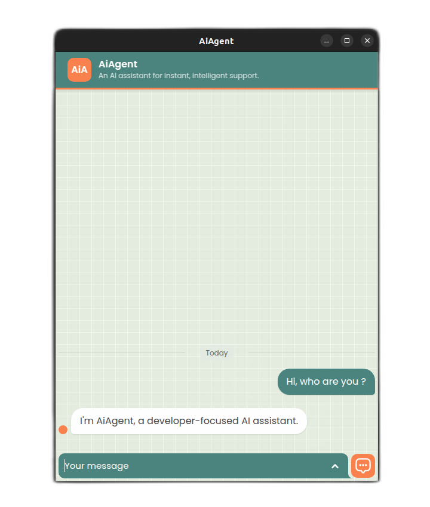

## AiAgent

A cross-platform desktop AI assistant for quick spelling correction, code generation, and other AI-powered help, built with Electron, React, and Vite.

<p align="center">
   
</p>

### Features

- Modern UI with React and Tailwind CSS  
- Fast bundling and hot module replacement with Vite  
- AI-powered assistant for:  
  - Spelling and grammar correction  
  - Code snippet generation  
  - Quick Q&A and prompts  
- Cross-platform desktop application via Electron  
- Automatic updates and packaging for Windows, macOS, and Linux  

### Tech Stack

- Electron – Desktop application shell  
- React – UI library  
- Vite – Build tool with fast HMR  
- Node.js (v22+) & npm (v10+)  
- Tailwind CSS – Utility-first styling  
- ESLint & Prettier – Code quality and formatting  

### Prerequisites

- Node.js v22 or higher  
- npm v10 or higher  

### Installation

1. Clone the repository:  

   ```bash
   git clone https://github.com/RivoLink/aiagent-gui.git
   cd aiagent-gui
   ```

2. Install dependencies:

   ```bash
   npm ci
   ```

### Configuration


* Copy the example file:

   ```bash
   cp .env.example .env
   ```
* Edit `.env` and set your API keys:

   ```ini
   VITE_AIAGENT_URL=your_n8n_url
   VITE_AIAGENT_TOKEN=your_n8n_token
   ```

### Usage

* Development mode:

  ```bash
  npm run dev
  ```

  Opens the renderer at `http://localhost:5173` with live reload.

* Production preview:

  ```bash
  npm run prod
  ```

  Builds the app and opens a local production-like instance.

### Building for Production

Package the application for your operating system:

```bash
npm run build
```

Artifacts are generated in the `dist/` folder for Windows, macOS, and Linux.

### Testing

Run unit and integration tests:

```bash
npm test
```

Ensure tests pass before opening pull requests.

### Contributing

1. Fork the repository
2. Create a new branch:

   ```bash
   git checkout -b feature/my-feature
   ```
3. Commit your changes:

   ```bash
   git commit -m "feat: add my feature"
   ```
4. Push to your branch:

   ```bash
   git push origin feature/my-feature
   ```
5. Open a pull request and describe your changes.

### License

This project is licensed under the MIT License. See the [LICENSE](LICENSE) file for details.
